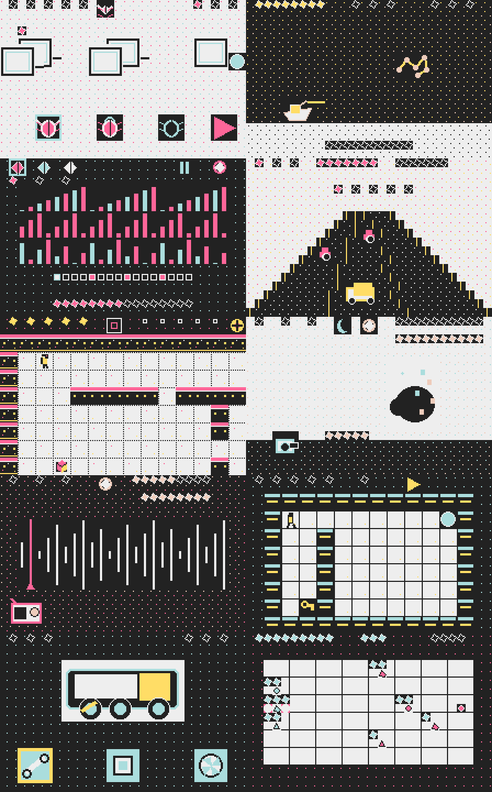

# SwanSong Originals

Ten original WonderSwan Color projects sharing one engine. Each builds as its
own `.wsc` cartridge. The original v1 collection proves portable game rules,
native graphics, deterministic outcomes, and clean replay/reset paths; a v2
production rebuild is now adding the presentation, audio, teaching, depth, and
replay structure expected of finished handheld games.



The v1 visual baseline replaced text layouts with Imagegen-directed source art
converted into native graphical tiles. That work established a distinctive
look and asset provenance; it is not treated as proof that the resulting
microgames are complete. The Yohaku style contract, source masters, prompt
formula, hashes, conversion tools, learning log, sprite atlases, and native
proofs are documented in [docs/art/full-screen/](docs/art/full-screen/).

## The ten games

| Project | Complete loop |
| --- | --- |
| Mote Sound Terminal | Play three original synth sequences, change track and tempo, and switch audio-reactive scopes |
| Orbital Courier | Find a parcel, route through obstacles, and deliver before fuel expires |
| Scrapframe Garage | Diagnose and repair three robots, then finish the shift with a scored result |
| Radio Ghost | Tune three hidden signals before dawn, assemble clues, and reach either ending |
| Harpoon Moon | Charge, fire, lure, tag three creatures, and defeat the leviathan before oxygen expires |
| Turncoat Tactics | Move and attack on a grid, recruit weakened enemies, and capture the beacon before command falls |
| Pocket Kaiju Observatory | Photograph three behaviors at the right distance without maxing disturbance |
| Rotate Dungeon | Toggle room geometry, collect keys, and clear five solvable rooms |
| One Last Lap | Race three laps, manage battery and lanes, and choose whether to tow a rival |
| Bug Witch | Place three kinds of logic familiars and solve five validated signal puzzles |

Detailed rules and controls are in [docs/CONCEPTS.md](docs/CONCEPTS.md).

## Production rebuild and testing

The v1 software scope is structurally complete and tested, but that is no
longer treated as proof of player-facing quality. The test suite covers
cartridge metadata, UI bounds, authored puzzle/route solvability, deterministic
endings, failure and reset paths, native-art provenance/tilemap integrity,
renderers, and fresh-boot SwanSong scenarios across all ten ROMs.

The cited [WonderSwan player-design research](docs/WONDERSWAN_PLAYER_DESIGN_RESEARCH.md),
hardware-grounded [game quality standard](docs/GAME_QUALITY_STANDARD.md), and
[rebuild roadmap](docs/GAME_REBUILD_ROADMAP.md) turn the 224×144 display,
3.072 MHz CPU, shared RAM, tile, sprite, scanline, input, and four-channel audio
limits into concrete game-design and release gates. Those gates cover a
persistent title and complete game flow, onboarding, background music and SFX,
session pacing, measured CPU/RAM/VRAM/sprite budgets, inspected SwanSong media,
and uncoached local playtesting. `make quality` reports the honest migration
baseline; it does not relabel automated execution as fun.

```sh
make clean test
make smoke
```

`make test` builds and structurally verifies every ROM, then runs the host-side
invariant, gameplay-path, and native-art suites. `make smoke` additionally runs
every declared scenario through SwanSong, checks visual and audio evidence,
requires distinct success/failure/reset outcomes, and repeats the success plan
bit-exactly. The retained evidence and remaining hardware limits are recorded in
[docs/STATUS.md](docs/STATUS.md).

For agent-driven black-box play rather than boot-only smoke testing, install the
[SwanSong Playtester](plugins/swansong-playtester/README.md). It exposes live
screenshots, frame-counted controls, and deterministic replay traces over MCP;
its required loop explicitly prevents a boot screen from being called a
gameplay pass.

## Build requirements

- Wonderful Toolchain installed at `/opt/wonderful`, or set
  `WONDERFUL_TOOLCHAIN` to another installation;
- Git submodules initialized with `git submodule update --init`;
- GNU Make;
- Python 3 for verification; and
- SwanSong Desktop for the rendered-frame smoke and agent playtest lanes.

Successful builds are copied into ignored local `dist/`. Build one game with:

```sh
make -C games/radio-ghost
```

Locally and continuously validated package revisions are recorded in
[toolchain.lock](toolchain.lock).

The [SwanSong SDK integration](docs/SDK-INTEGRATION.md) records the ten
schema-v1 game manifests, deterministic play contracts, resource budgets, and
migration lessons. Release builds use the content-addressed
`vendor/swansong-sdk` v0.5.0 submodule. `SWANSONG_SDK_DIR` can still select
another SDK checkout for local compatibility testing.

## Repository map

- `vendor/swansong-sdk/` — pinned SDK runtime, generator, and SwanSong tooling;
- `shared/` — small anthology-side SDK adapters for the eight remaining legacy
  renderers, semantic input helpers, and feedback audio;
- `engine/` — retained pre-SDK engine source for migration reference only;
- `games/` — ten independent cartridge projects;
- `mk/` — common Wonderful build rules;
- `tools/` — ROM, UI, gameplay-path, and SwanSong execution checks;
- `artist-personas/yohaku/` — validated, versioned house-style contract,
  benchmarks, failure modes, and prompt recipes;
- `docs/` — game manual, originality policy, QA, source masters, and art
  provenance; and
- `dist/` — ignored local cartridge output.

`make art` reruns the shared, deterministic master-to-tile pipeline when a
future game or visual lesson is added.

## Originality and compatibility

The game names, characters, settings, code, music sequences, symbols, and
concept artwork are original to this project. Platform names are used only to
describe compatibility. See [docs/ORIGINALITY.md](docs/ORIGINALITY.md).

Code is MIT-licensed. Generated source art is retained transparently as project
source material and is not covered by the software license unless stated
separately.
