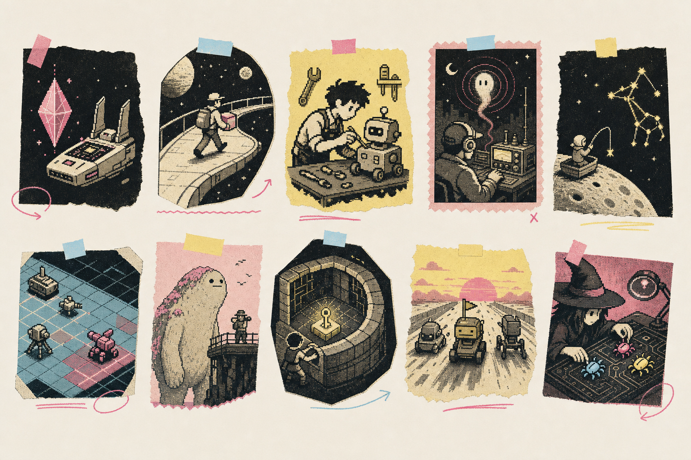

# SwanSong Originals

Ten small, original WonderSwan Color games sharing one engine. Each project
builds as its own `.wsc` cartridge and is complete within a deliberately compact
microgame scope: controls, gameplay state, feedback, an ending or continuous
utility loop, and a clean replay/reset path.



## The ten games

| Project | Complete v1 loop |
| --- | --- |
| Mote Sound Terminal | Play three original synth sequences, change track and tempo, and switch audio-reactive scopes |
| Orbital Courier | Find a parcel, route through obstacles, and deliver before fuel expires |
| Scrapframe Garage | Diagnose and repair three robots, then finish the shift with a scored result |
| Radio Ghost | Tune three hidden signals before dawn, assemble clues, and reach either ending |
| Harpoon Moon | Charge, fire, lure, tag three creatures, and defeat the leviathan before oxygen expires |
| Turncoat Tactics | Move and attack on a grid, recruit weakened enemies, and capture the beacon before command falls |
| Pocket Kaiju Observatory | Photograph three behaviors at the right distance without maxing disturbance |
| Rotate Dungeon | Toggle room geometry, collect keys, and clear five solvable rooms |
| One Last Lap | Race three laps, manage battery and lanes, and choose whether to tow a rival |
| Bug Witch | Place three kinds of logic familiars and solve five validated signal puzzles |

Detailed rules and controls are in [docs/CONCEPTS.md](docs/CONCEPTS.md).

## Completion and testing

The v1 software scope is complete and tested as ten short-session games. The
test suite covers cartridge metadata, UI bounds, authored puzzle/route
solvability, deterministic success and failure paths, reset behavior, and
rendered emulator startup for all ten ROMs.

```sh
make clean test
make smoke
```

`make test` builds and structurally verifies every ROM, then runs the host-side
invariant and gameplay-path suites. `make smoke` additionally launches every ROM
in Mednafen and requires a nonblank rendered frame. The retained evidence and
remaining hardware limits are recorded in [docs/STATUS.md](docs/STATUS.md).

## Build requirements

- Wonderful Toolchain installed at `/opt/wonderful`, or set
  `WONDERFUL_TOOLCHAIN` to another installation;
- GNU Make;
- Python 3 for verification; and
- Mednafen plus FFmpeg for the optional rendered-frame smoke lane.

Successful builds are copied into ignored local `dist/`. Build one game with:

```sh
make -C games/radio-ghost
```

Locally and continuously validated package revisions are recorded in
[toolchain.lock](toolchain.lock).

## Repository map

- `engine/` — shared input, fixed console UI, VBlank, PRNG, meters,
  orientation state, and wavetable feedback audio;
- `games/` — ten independent cartridge projects;
- `mk/` — common Wonderful build rules;
- `tools/` — ROM, UI, gameplay-path, and emulator checks;
- `docs/` — game manual, originality policy, QA, art provenance, and the
  [pixel-zine style contract](docs/art/STYLE.md); and
- `dist/` — ignored local cartridge output.

## Originality and compatibility

The game names, characters, settings, code, music sequences, symbols, and
concept artwork are original to this project. Platform names are used only to
describe compatibility. See [docs/ORIGINALITY.md](docs/ORIGINALITY.md).

Code is MIT-licensed. Generated concept art is retained as project source
material and is not covered by the software license unless stated separately.
